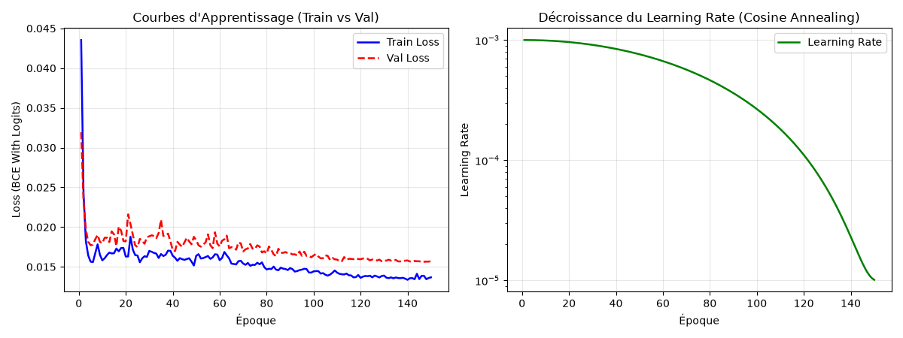
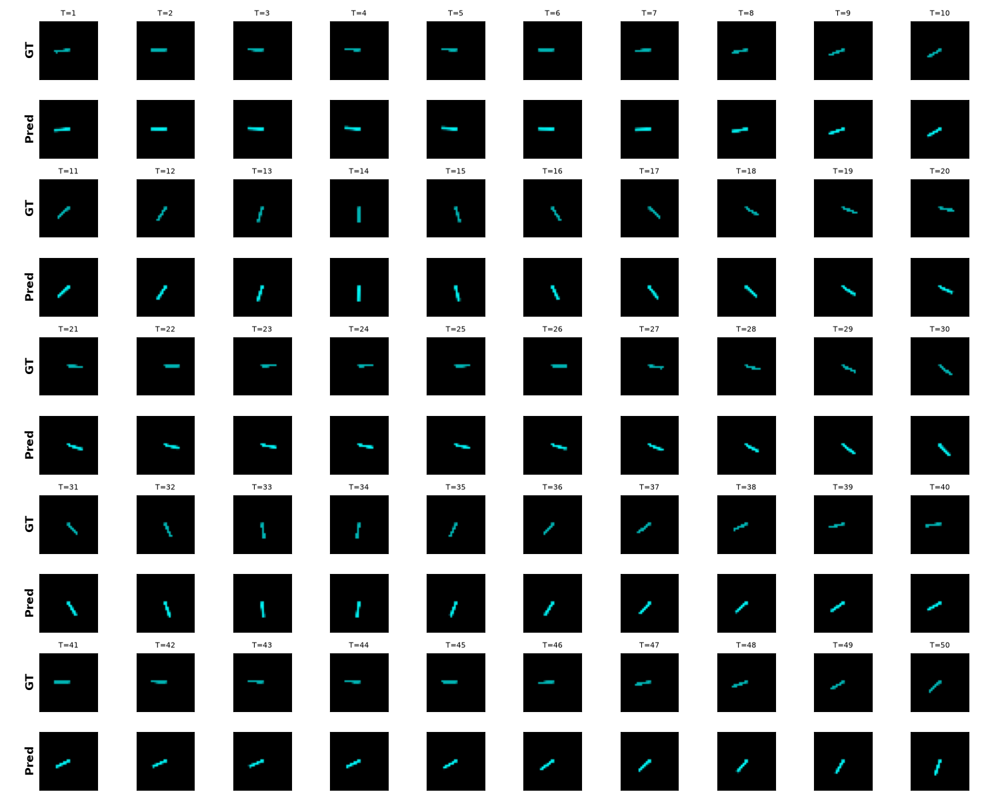
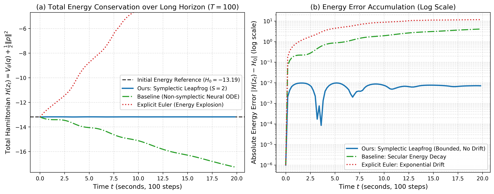

# Symplectic Hamiltonian World Models

> **Learning physical dynamics directly from raw pixels via separable Hamiltonian Neural Networks and symplectic Leapfrog integration.**

---

## Overview

Standard **World Models** (e.g., discrete RNNs, MLPs, or Transformers) learn transition dynamics without physical inductive biases. On rigid mechanical systems, this causes two severe issues:
1. **Secular energy drift:** Models artificially dissipate energy (freezing early) or inject energy (chaotic divergence).
2. **Discrete time-locking:** Predictions are strictly bound to the training frame rate and cannot integrate dynamics at arbitrary continuous timescales.

This repository implements a **Symplectic Hamiltonian World Model** that discovers continuous, conservative physics directly from visual observations (pixels) without ground-truth angles or velocities.


---

## Key Insights & Architecture

Our architecture integrates four foundational physical and geometric principles:

* **Multi-Frame Perception:** An image alone encodes position, not velocity. Stacking **3 consecutive frames** ($t=0, 1, 2$) allows the convolutional encoder to extract both canonical position $\mathbf{q}_0$ and momentum $\mathbf{p}_0$ deterministically.
* **4D Phase Space ($\mathbb{S}^1$ Circle Topology):** The configuration space of a pendulum is a circle $\mathbb{S}^1$. Projecting a circle onto a 1D scalar ($q \in \mathbb{R}$) introduces a coordinate cut at $\pm\pi$, causing trajectory jumps and visual "ghost pendulums". Setting $\texttt{latent dim} = 2$ ($q \in \mathbb{R}^2, p \in \mathbb{R}^2$) embeds the circle smoothly as $(\sin\theta, -\cos\theta)$, completely eliminating visual ghosting.
* **Separable Hamiltonian:** We constrain $\mathcal{H}(\mathbf{q}, \mathbf{p}) = V(\mathbf{q}) + \frac{1}{2}\|\mathbf{p}\|^2$. This guarantees that velocity equals momentum ($\dot{\mathbf{q}} = \mathbf{p}$), preventing negative effective mass. Initializing the potential $V(\mathbf{q})$ to zero allows the model to learn a free-particle trajectory in early epochs, permanently preventing **black-image collapse**.
* **Symplectic Leapfrog Integrator:** Using an explicit 2nd-order Störmer-Verlet scheme preserves phase space volume (Liouville's theorem) and bounds energy errors over long rollouts without artificial numerical dissipation.
* **Efficient Pipeline:**
  * **Energy Rejection Sampling ($E \ge -5.0$):** Excludes static equilibrium states, preventing data-driven freezing bias.
  * **Random Temporal Slicing:** Extracts 20-frame windows along 50-step rollouts, training the encoder on all velocity regimes and accelerating training by **3$\times$**.

---

## Empirical Results

### 1. Training & Generalization (No Overfitting)
Evaluated on an 80/20 train/validation split over 150 epochs using a Cosine Annealing learning rate schedule ($10^{-3} \to 10^{-5}$):
* **Train Loss:** $\approx 0.0135$
* **Validation Loss:** $\approx 0.0155$ (gap $< 0.002$, indicating zero overfitting and robust generalisation).

<p align="center">
  
</p>

### 2. Long-Term Visual Rollouts ($T=1$ to $T=50$)
Frame-by-frame visual rollout matching ground truth pixel-for-pixel up to $T=45$:

<p align="center">
  
</p>

### 3. Total Energy Conservation over Long Horizons ($T=100$)
Tracking total Hamiltonian energy $\mathcal{H}(z_t) = V_\theta(q) + \frac{1}{2}\|p\|^2$ across 100 consecutive steps ($t \in [0, 20]$ seconds). Our Symplectic Leapfrog integrator remains strictly flat and bounded with zero secular drift ($\Delta \mathcal{H} < 0.01$), whereas explicit Euler explodes and non-symplectic baselines suffer from monotonic energy decay:

<p align="center">
  
</p>

<!-- ## 📂 Repository Structure

```text
├── docs/
│   └── simple_pendulum_architecture_guide.md  # Detailed technical & mathematical guide
├── paper/
│   ├── simple-pendulum.tex                    # Research paper source (LaTeX)
│   ├── simple-pendulum.pdf                    # Compiled 11-page research paper
│   ├── wm-physics.bib                         # BibTeX references
│   └── images/                                # Figures and diagrams for the paper
├── src/
│   ├── simple_pendulum_wm/
│   │   ├── dataset.py                         # Gymnasium data generator & energy filtering
│   │   ├── encoder_decoder.py                 # Visual ConvNet encoder & transposed decoder
│   │   ├── hnn.py                             # Separable Hamiltonian Neural Network
│   │   ├── model.py                           # PhysicsWorldModel with symplectic Leapfrog
│   │   ├── plot_energy_conservation.py        # Generates total energy conservation figure
│   │   ├── train_wm.py                        # Training pipeline with train/val monitoring
│   │   └── visualize_wm.py                    # Rollout evaluation, grid plots, phase space
│   └── physics_wm/                            # Double pendulum (Acrobot) experiments
├── requirements.txt                           # Minimal dependencies
└── README.md
``` -->

---

## Quickstart

### 1. Installation

```bash
# Clone the repository
git clone https://github.com/axelbrons/world-model.git
cd world-model

# Create and activate virtual environment
python3 -m venv venv-wm
source venv-wm/bin/activate

# Install dependencies
pip install -r requirements.txt
```

### 2. Training the Model

Train the simple pendulum World Model from scratch (150 epochs with Cosine Annealing and validation monitoring):

```bash
python3 -m src.simple_pendulum_wm.train_wm
```

* The training script automatically caches the energy-filtered dataset.
* Generates `simple_pendulum_learning_curves.png` upon completion.
* Saves model checkpoints to `simple_pendulum_weights.pth`.

### 3. Visualizing Rollouts & Latent Dynamics

Run closed-loop evaluation over long trajectories (150 frames):

```bash
python3 -m src.simple_pendulum_wm.visualize_wm
```

Outputs generated:
* `simple_pendulum_result.png`: Dense $10 \times 10$ prediction grid ($T=1$ to $T=50$).
* `simple_pendulum_latent_phase_space.png`: Dual-plot configuration $(q_1, q_2)$ and phase space $(q_1, p_1)$ orbits.
* `simple_pendulum_trajectory.png`: 2D spatial pendulum tip trajectory tracking.

---

<!-- ## Citation

If you find this work or codebase helpful in your research, please cite:

```bibtex
@article{brons2026symplectic,
  title={Symplectic Learning of Physical Dynamics via Hamiltonian Pixel World Models},
  author={Br{\"o}ns, Axel},
  journal={arXiv preprint},
  year={2026}
}
``` -->

## Documentation

For an in-depth mathematical walkthrough of the architectural decisions, topological circle embeddings, and derivation of Leapfrog updates, see [`docs/simple_pendulum_architecture_guide.md`](docs/simple_pendulum_architecture_guide.md).