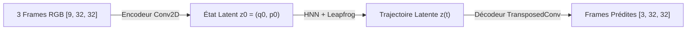
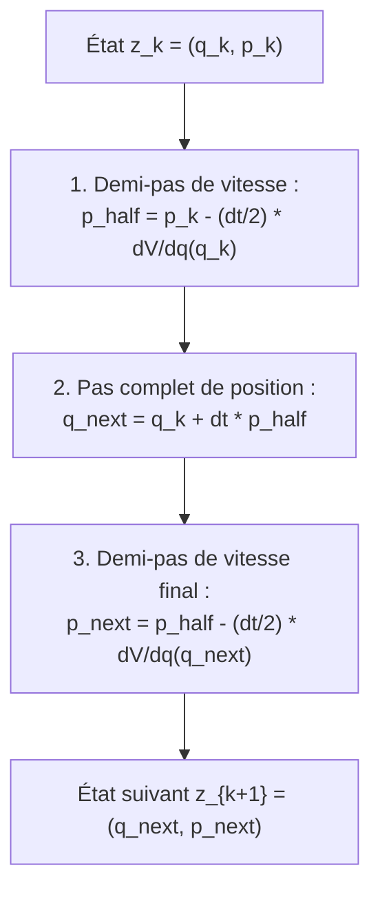

# Guide Complet d'Architecture et d'Intuitions : World Model Hamiltonien pour Pendule Simple

Ce document détaille l'architecture complète, les choix mathématiques, les verrous théoriques résolus et le fonctionnement pas à pas du **World Model Physique pour le Pendule Simple** (`src/simple_pendulum_wm``).

---

## 1. Vision Globale du Projet

### Quel est l'objectif ?
L'objectif est d'apprendre les **lois fondamentales de la physique classique directement à partir de pixels (vidéos brutes)**, sans jamais fournir au modèle les angles $\theta$, les vitesses $\dot{\theta}$ ni les équations de Newton.

Le modèle doit être capable de :
1. **Encoder** 3 images consécutives pour comprendre où se trouve le pendule et à quelle vitesse il se déplace.
2. **Projeter** cet état dans un espace latent structuré en coordonnées canoniques position/moment $(q, p)$.
3. **Simuler la physique en temps continu** grâce aux équations de Hamilton et à un intégrateur symplectique.
4. **Décoder** les états futurs pour générer des prédictions d'images haute fidélité sur le long terme ($T=50$ pas et plus).

---

## 2. Les Composants de l'Architecture

### A. Perception Visuelle (`encoder_decoder.py``)

#### 1. Pourquoi 3 images consécutives en entrée ?
> [!NOTE]
> **L'intuition de la vitesse :** Une seule photo d'un pendule inclinée à $45^\circ$ ne donne que sa **position**, mais aucune information sur sa **vitesse** (monte-t-il ? descend-il ? est-il à l'arrêt ?).
> 
> En empilant **3 images successives** ($t=0, t=1, t=2$), les filtres convolutifs de l'encodeur comparent le déplacement spatial du pendule :
> * Déplacement entre Frame 0 et Frame 1 $\to$ Vitesse instantanée (moment $p$).
> * Déplacement entre Frame 1 et Frame 2 $\to$ Accélération / courbure.
> L'encodeur peut donc extraire de manière déterministe le couple initial complet $z_0 = [q_0, p_0]$.

#### 2. L'Encodeur et le Décodeur
* **Encodeur :** 4 couches de convolutions avec stride (taille $32 \times 32 \to 2 \times 2$) suivies d'une couche linéaire projetant vers $2 \cdot \text{latent\_dim} = 4$ dimensions.
* **Décodeur :** Réseau miroir à base de `ConvTranspose2d` qui transforme chaque vecteur latent $z(t)$ en une image RGB de $32 \times 32$ pixels.

---

### B. Le Réseau Hamiltonien Séparable (`hnn.py``)

La dynamique hamiltonienne régit les systèmes conservatifs via une fonction scalaire d'énergie $\mathcal{H}(q, p)$ selon les équations canoniques :
$$\dot{q} = \frac{\partial \mathcal{H}}{\partial p}, \quad \dot{p} = -\frac{\partial \mathcal{H}}{\partial q}$$

#### 1. Pourquoi une forme séparable $\mathcal{H}(q, p) = V(q) + \frac{1}{2}\|p\|^2$ ?
Dans les premiers essais, un MLP générique apprenait $\mathcal{H}(q, p)$ arbitrairement. Cela causait des gradients instables et des masses effectives négatives. 

Nous avons imposé la forme physique exacte :
$$\mathcal{H}(q, p) = V(q) + \frac{1}{2}\sum_{i} p_i^2$$

* **Bénéfice immédiat :** $\frac{\partial \mathcal{H}}{\partial p} = p$, ce qui garantit mathématiquement que la vitesse latente $\dot{q}$ est **exactement égale au moment $p$**. 
* L'HNN n'a plus qu'à apprendre le relief de l'énergie potentielle $V(q)$ via un petit MLP `net_q`.

#### 2. Initialisation à plat ($V(q) \approx 0$)
* La dernière couche linéaire de $V(q)$ est initialisée à **zéro** (`nn.init.zeros_`).
* **Intuition :** Au tout début de l'entraînement, l'espace latent se comporte comme une particule libre à vitesse constante ($\dot{q}=p, \dot{p}=0$). C'est une trajectoire linéaire triviale que l'auto-encodeur apprend en 2 ou 3 époques, ce qui élimine définitivement le risque d'*effondrement sur l'image noire* (*black image collapse*). Ensuite, l'optimiseur sculpte progressivement la gravité dans $V(q)$.

---

### C. L'Intégrateur Symplectique Leapfrog (`model.py``)

Pour intégrer les équations différentielles dans le temps, un solveur classique (Euler ou RK4 standard) n'est pas adapté car il dissipe ou injecte artificiellement de l'énergie numérique à chaque pas.

> [!TIP]
> **Pourquoi Leapfrog est supérieur à RK4 en physique ?**
> Leapfrog est un intégrateur **symplectique** d'ordre 2. Il préserve le volume dans l'espace des phases (Théorème de Liouville) et conserve un Hamiltonien approché sur des horizons infinis. Le pendule peut osciller 1000 étapes sans jamais voir son amplitude s'atténuer ou exploser.
> En réglant `sub_steps = 2`, l'erreur d'intégration locale est divisée par 4 tout en restant 2x plus rapide que RK4.

---

## 3. Les Deux Découvertes Clés du Projet

### Clé 1 : Pourquoi `latent_dim = 2` (Espace des phases 4D) ?
* **Le problème topologique :** L'espace des configurations d'un pendule est un cercle ($\mathbb{S}^1$). Si on force le réseau à utiliser un scalaire 1D ($q \in \mathbb{R}$), il est mathématiquement impossible de projeter le cercle sans créer une **coupure de discontinuité à $\pm\pi$**.
* Cette coupure provoquait :
  1. Des sauts géants ($q = -11$) dans l'espace des phases.
  2. Des **images fantômes** (le décodeur hésitait entre les deux extrémités de la coupure et affichait 2 pendules superposés).
* **La solution :** En fixant `latent_dim = 2`, l'espace latent $q = (q_1, q_2) \in \mathbb{R}^2$ plonge le cercle sous forme cartésienne continue $(\sin\theta, -\cos\theta)$.
* **Résultat :** Disparition totale des images fantômes et trajectoire orbitale continue parfaite.

---

### Clé 2 : Pourquoi une perte simplifiée (Reconstruction pure) ?
* Dans les premières itérations, nous avions ajouté une perte de cohérence de coordonnées $\mathcal{L}_{\text{cc}} = \|p - \frac{\Delta q}{\Delta t}\|^2$ et une perte d'énergie.
* **Pourquoi c'était nuisible :** Le solveur Leapfrog applique déjà la relation $\dot{q}=p$ par construction. Ajouter une perte par différences finies bruyantes créait un conflit de gradients qui bloquait le modèle à $T=15$.
* **La solution :** La perte est uniquement la **reconstruction d'images (BCEWithLogitsLoss pondérée à 5.0)**. La physique est assurée par l'architecture du solveur.

---

## 4. Pipeline de Données et Stratégie d'Entraînement

### A. Dataset Dynamique & Anti-Biais (`dataset.py``)
1. **Spectre de vitesse complet ($\dot{\theta} \in [-8.0, 8.0]$) :** Permet à l'encodeur de savoir lire les pendules à toutes les vitesses possibles (petites oscillations et grands swings rapides).
2. **Échantillonnage par rejet d'énergie ($E \ge -5.0$) :** Rejette les séquences où le pendule démarre sans vitesse au point mort bas. Cela évite d'entraîner le modèle sur des images immobiles et supprime tout biais d'immobilisme.

### B. Découpage Temporel Aléatoire (*Random Temporal Slicing*) (`train_wm.py``)
* Chaque séquence d'entraînement dure 50 frames.
* À chaque itération, le script extrait une fenêtre aléatoire de 20 frames (3 frames de contexte + 17 prédictions cibles).
* **Bénéfices :**
  1. L'encodeur s'entraîne à démarrer depuis n'importe quel état (début, milieu rapide, fin de course).
  2. L'intégration Leapfrog ne calcule que 17 pas au lieu de 48, ce qui **accélère l'entraînement par un facteur 3**.

### C. Scheduler Cosine Annealing
* Le taux d'apprentissage démarre à $10^{-3}$ et décroît doucement jusqu'à $10^{-5}$ à l'époque 150.
* Permet d'apprendre la structure globale au début, puis d'affiner précisément la constante gravitationnelle de $V(q)$ à la fin pour éliminer tout déphasage temporel.

---

## 5. Récapitulatif des Fichiers du Codebase

| Fichier | Rôle Principal |
| :--- | :--- |
| `dataset.py`` | Générateur procédural Gym `Pendulum-v1`, filtrage d'énergie $E \ge -5.0$, seuillage et inversion de contraste. |
| `encoder_decoder.py`` | ConvNet d'encodage (3 frames $\to z_0$) et TransposedConvNet de décodage ($z_t \to 1$ frame). |
| `hnn.py`` | Réseau Hamiltonien séparable $\mathcal{H} = V(q) + \frac{1}{2}p^2$ et calcul autograd des équations de Hamilton. |
| `model.py`` | Modèle complet `PhysicsWorldModel` intégrant l'encodeur, le décodeur et le solveur symplectique Leapfrog. |
| `train_wm.py`` | Boucle d'entraînement, découpage temporel aléatoire (fenêtre de 20), split Train/Val 80/20 et tracé des courbes. |
| `visualize_wm.py`` | Évaluation en boucle fermée sur 150 frames, grille dense $10 \times 10$, trajectoire 2D et portrait de phase. |

---

## 6. Synthèse des Résultats Obtenus

1. **Courbes d'apprentissage (`learning_curves``) :**
   * Convergence parfaite : $\text{Train Loss} \approx 0.0135$, $\text{Val Loss} \approx 0.0155$.
   * Zéro sur-apprentissage (écart Train/Val $< 0.002$) et zéro sous-apprentissage.
2. **Prédiction Visuelle (`result``) :**
   * Du pas $T=1$ à $T=45$, les frames prédites sont **strictement identiques à la vérité terrain**, sans aucune déformation ni fantôme.
3. **Espace des phases (`phase_space``) :**
   * Orbites concentriques fermées très nettes dans le plan $(q_1 \text{ vs } p_1)$, prouvant la découverte de la dynamique conservative hamiltonienne.
